# 🛡️ Tech Trove Cloud Security
**Author:** Sahil Faraz | **Date:** November 2025

> **Academic Disclaimer:** This repository contains an academic project for the **Pearson B-TEC HND in Digital Technologies (Cybersecurity) - Unit 23: Applied Security in the Cloud** module. It is strictly for portfolio and demonstration purposes. Other students may not use or copy this material for their own academic submissions.

## 📌 Project Overview
This repository contains the database architecture and security configurations for a simulated fast-growing software company, Tech Trove Innovations. The project focuses on hardening a cloud-based MySQL database hosted on Amazon Web Services (AWS) Relational Database Service (RDS).

The primary objective is to implement a robust, layered defense-in-depth model that complies with industry standards, including NIST SP 800-53, ISO 27017, and the CSA Cloud Controls Matrix (CCM).

---

## 🏗️ Architecture & Defense in Depth
The security architecture focuses on protecting data at rest, data in transit, and ensuring reliable access for authorized personnel[cite: 129].

| Security Layer | Implemented Control | Framework Alignment |
| :--- | :--- | :--- |
| **Data Protection** | AES-256 Encryption for sensitive columns. | ISO 27017 & NIST SP 800-53 |
| **Access Control** | Role-Based Access Control (RBAC) via strict IAM policies. | CSA CCM IAM-01 & NIST AC-2 |
| **Monitoring** | CloudWatch metrics and SQL access log reviews. | NIST CA-7 & ISO 27017 |
| **Resilience** | Automated RDS snapshots and manual encrypted backups. | CSA CCM DSI-02 |

---

## 🔐 Key Security Implementations

* **Role-Based Access Control (RBAC):** Enforced the principle of least privilege using granular MySQL `GRANT` commands for distinct roles (Admin, Manager, Engineer, Analyst, Support, Auditor, Team Lead).

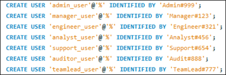
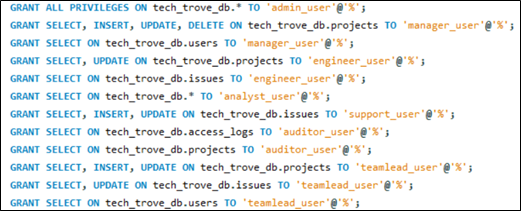
* **Cryptographic Controls:** Applied AES-256 encryption to sensitive fields including client names, emails, budgets, and issue reports.

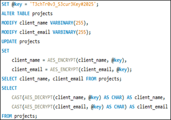
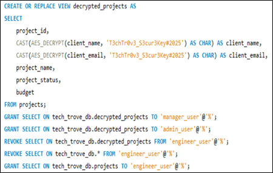
* **Dynamic Decrypted Views:** Created secure database views that dynamically decrypt data only for highly privileged roles, leaving data masked as cipher text for unauthorized engineers and analysts.

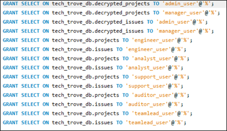
* **Automated Audit Trails:** Developed custom SQL triggers and stored procedures to instantly log all data access and modification events into an `access_logs` table for compliance tracking.

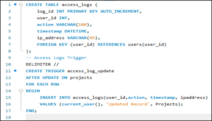
* **Threat Mitigation:** Implemented parameterized SQL queries to successfully block SQL injection attempts.

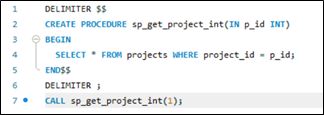

---

## 📊 Cloud Monitoring & Incident Response

To maintain high availability and rapidly detect anomalies, the following AWS monitoring strategies were integrated:

* **Amazon CloudWatch:** Configured to monitor CPU utilization, storage capacity, and query latency with automated alarm thresholds.

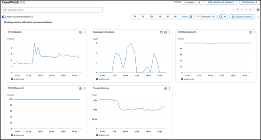

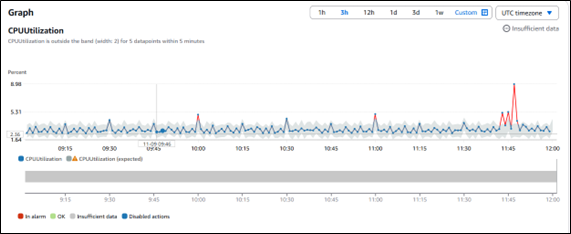

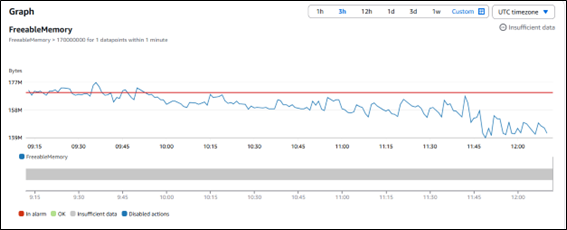
* **AWS CloudTrail:** Enabled with MySQL access logs to trace administrator actions, monitor privilege changes, and detect unauthorized access attempts.

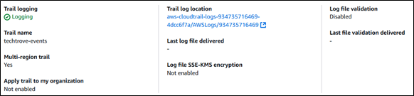

* **AWS Inspector:** Scheduled to evaluate the RDS environment against security baselines and identify misconfigurations.

---

## 📈 Benchmarking & Performance Results

Extensive penetration testing and performance benchmarking were conducted post-deployment. The security implementations were optimized to ensure they did not degrade system performance.

| Performance Metric | Before Adaptation | After Optimization |
| :--- | :--- | :--- |
| **Average Query Response Time** | 0.43 seconds | 0.37 seconds |
| **System Uptime** | 95% | 99.97% |
| **Mean Time to Detect (MTTD)** | 4 minutes | 1.5 minutes |
| **Access Control Accuracy** | 94%  | 97% |

---

## 📂 Repository Contents

While the original AWS RDS instance has been decommissioned, the security architecture can be replicated locally or on a new cloud instance using the provided source code.
*   `MySQL/`: Contains all the sql files that were used in this project
*   `Datasets/`: Contains the relevant datasets used to make the MySQL Tables.
*   `Images/`: Contains screenshots of the MySQL and AWS RDS Metrics
> **Note:** The encryption keys and user credentials contained within the SQL scripts are strictly for academic demonstration purposes and must be rotated before use in a production environment.
